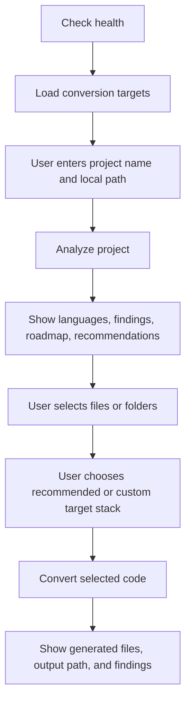

# O2N Engine Frontend API Documentation

## 1. Overview

O2N Engine analyzes a local codebase, identifies languages and selected legacy patterns, creates a modernization roadmap, and can generate converted code into a new folder.

The backend currently has no authentication. Do not expose it publicly until authentication and a safe project-upload/workspace flow are added.

## 2. Backend URLs

When running locally on port `8081`:

```text
API base URL: http://127.0.0.1:8081
Swagger UI:   http://127.0.0.1:8081/docs
Health check: http://127.0.0.1:8081/health
```

For a frontend running on `http://localhost:3000`, the default CORS configuration allows requests. If the frontend uses another origin, set `CORS_ORIGINS` in the backend `.env` file as a comma-separated list.

```env
CORS_ORIGINS=http://localhost:3000,http://localhost:5173
```

## 3. Important Path Rule

`path` is an absolute path on the machine where the backend runs, not necessarily the browser user's machine.

For a locally installed desktop-style frontend and local backend, a Windows path is valid:

```json
{
  "path": "E:\\projects\\legacy-shop"
}
```

A normal hosted web frontend cannot send a visitor's local disk path to a remote backend. For that product model, add a ZIP upload or Git repository connection first.

## 4. Endpoint Summary

| Method | Endpoint | Frontend use |
| --- | --- | --- |
| `GET` | `/` | Show backend availability or startup status. |
| `GET` | `/health` | Health check before enabling actions. |
| `GET` | `/api/v1/conversion-targets` | Populate target-stack dropdown. |
| `POST` | `/api/v1/projects/analyze` | Analyze a project and show report, suggestions, and roadmap. |
| `POST` | `/api/v1/projects/convert` | Convert selected project-relative files or folders into a separate output directory. |

## 5. Recommended Frontend Flow



Suggested screens:

1. **Analyze screen**: project name, absolute project path, preferred target stack.
2. **Report screen**: language counts, findings grouped by severity, migration recommendations, and roadmap.
3. **Conversion screen**: selected source paths, target-stack dropdown/custom target input, optional output directory.
4. **Result screen**: generated file list, code preview/diff, output folder, and generated-code findings.

## 6. `GET /`

Use this optional endpoint for a lightweight backend status check.

### Response: `200 OK`

```json
{
  "message": "O2N Engine Backend Running",
  "status": "success",
  "docs": "/docs",
  "health": "/health"
}
```

## 7. `GET /health`

Use before submitting analysis or conversion jobs.

### Response: `200 OK`

```json
{
  "status": "ok"
}
```

## 8. `GET /api/v1/conversion-targets`

Use this result to populate a dropdown. The frontend must also offer a custom text input because custom target stacks are supported.

### Response: `200 OK`

```json
{
  "targets": [
    "Next.js + FastAPI",
    "React + Node.js/Express",
    "React + Django",
    "Vue + FastAPI",
    "Angular + Spring Boot",
    "Laravel",
    "Django",
    "FastAPI",
    "Node.js/Express",
    ".NET Web API",
    "Java Spring Boot"
  ],
  "custom_target_supported": true
}
```

## 9. `POST /api/v1/projects/analyze`

Starts a synchronous project analysis. Disable the submit button and show a loading state until the request completes because a large project, Semgrep scan, or AI roadmap can take time.

### Request body

```json
{
  "name": "Legacy Shop",
  "path": "E:\\projects\\legacy-shop",
  "target_stack": "Next.js + FastAPI"
}
```

| Field | Required | Type | Rules |
| --- | --- | --- | --- |
| `name` | Yes | string | 1 to 120 characters. |
| `path` | Yes | string | Existing absolute directory accessible to backend. |
| `target_stack` | No | string | Defaults to `Next.js + FastAPI`; used for roadmap generation. |

### Response: `200 OK`

```json
{
  "id": "b92cae61-78bf-48c8-96b7-5f8b1e335baf",
  "name": "Legacy Shop",
  "path": "E:\\projects\\legacy-shop",
  "status": "complete",
  "created_at": "2026-07-19T12:30:00Z",
  "languages": {
    "PHP": 18,
    "JavaScript": 12
  },
  "findings": [
    {
      "severity": "medium",
      "category": "syntax",
      "message": "Tree-sitter found a syntax error",
      "file": "E:\\projects\\legacy-shop\\api\\example.py"
    }
  ],
  "recommendations": [
    {
      "current_technology": "PHP",
      "reason": "PHP source files were detected; modern API boundaries can simplify an incremental migration.",
      "recommended_targets": ["FastAPI", "Laravel", "Node.js/Express"]
    },
    {
      "current_technology": "jQuery",
      "reason": "jQuery-style DOM manipulation was detected in JavaScript files.",
      "recommended_targets": ["React", "Next.js", "Vue"]
    }
  ],
  "roadmap": [
    {
      "phase": "1. Baseline",
      "action": "Add tests and capture current behavior",
      "rationale": "Protect business logic before changing the migration surface."
    }
  ],
  "summary": "Scanned 30 source files across 2 language(s)."
}
```

### UI rendering guidance

- Render `languages` as a table, chart, or compact badges with file counts.
- Group `findings` by `severity`: `info`, `medium`, `high`, or the severity supplied by Semgrep.
- Render `recommendations` as selectable migration cards. Selecting a target can prefill the conversion target dropdown.
- Render `roadmap` in the returned order, using `phase` as the title and `action`/`rationale` as details.
- Empty arrays mean no findings or no detected legacy recommendation, not an error.

### Error: `400 Bad Request`

```json
{
  "detail": "The provided project path does not exist or is not a folder."
}
```

## 10. `POST /api/v1/projects/convert`

Generates converted code for selected files or folders. This endpoint needs `ANTHROPIC_API_KEY` configured in the backend environment.

The original project is never modified. Generated code is written only to a newly created output directory.

### Request body

```json
{
  "name": "Legacy Shop Migration",
  "path": "E:\\projects\\legacy-shop",
  "source_paths": [
    "api/users.php",
    "public/js/app.js"
  ],
  "target_stack": "Next.js + FastAPI",
  "output_directory": "E:\\converted-projects\\legacy-shop-next-fastapi"
}
```

| Field | Required | Type | Rules |
| --- | --- | --- | --- |
| `name` | Yes | string | 1 to 120 characters. |
| `path` | Yes | string | Existing absolute source project directory. |
| `source_paths` | Yes | string array | One or more project-relative source files or directories. Maximum 20 supported source files after expansion. |
| `target_stack` | Yes | string | Dropdown selection or custom value; 1 to 120 characters. |
| `output_directory` | No | string | New absolute output path. It must be outside the source project and must not already exist. |

If `output_directory` is omitted, the backend creates a sibling folder such as:

```text
E:\projects\legacy-shop_converted_a1b2c3d4
```

### Response: `200 OK`

```json
{
  "id": "9c1e977f-6f4f-4d6d-a943-9af1126c4eb4",
  "name": "Legacy Shop Migration",
  "project_path": "E:\\projects\\legacy-shop",
  "target_stack": "Next.js + FastAPI",
  "output_directory": "E:\\converted-projects\\legacy-shop-next-fastapi",
  "generated_files": [
    {
      "path": "backend/app/routes/users.py",
      "content": "from fastapi import APIRouter\n\nrouter = APIRouter()\n"
    },
    {
      "path": "frontend/app/users/page.tsx",
      "content": "export default function UsersPage() { return <main>Users</main>; }\n"
    }
  ],
  "findings": [],
  "summary": "Generated 2 file(s) from 2 selected source file(s)."
}
```

### Conversion safety behavior

- The source project remains unchanged.
- `source_paths` must stay inside `path`; `..` traversal is rejected.
- Output directory must be outside the source project.
- The output directory must not already exist.
- AI-generated output paths cannot be absolute and cannot contain `..`.
- Only supported code files are converted.
- Conversion needs a configured Anthropic API key.

### Error: `400 Bad Request`

Common examples:

```json
{ "detail": "ANTHROPIC_API_KEY is required to generate converted code." }
```

```json
{ "detail": "Source path does not exist: api/missing.php" }
```

```json
{ "detail": "Source path escapes the project directory: ../private-file.py" }
```

```json
{ "detail": "Output directory already exists; choose a new empty location." }
```

## 11. Frontend Fetch Examples

Define the base URL once:

```ts
const API_BASE_URL = "http://127.0.0.1:8081";
```

Load the dropdown options:

```ts
export async function getConversionTargets() {
  const response = await fetch(`${API_BASE_URL}/api/v1/conversion-targets`);
  if (!response.ok) throw new Error("Could not load conversion targets.");
  return response.json() as Promise<{
    targets: string[];
    custom_target_supported: boolean;
  }>;
}
```

Analyze a project:

```ts
export async function analyzeProject(payload: {
  name: string;
  path: string;
  target_stack?: string;
}) {
  const response = await fetch(`${API_BASE_URL}/api/v1/projects/analyze`, {
    method: "POST",
    headers: { "Content-Type": "application/json" },
    body: JSON.stringify(payload),
  });

  const data = await response.json();
  if (!response.ok) throw new Error(data.detail ?? "Project analysis failed.");
  return data;
}
```

Convert selected code:

```ts
export async function convertProject(payload: {
  name: string;
  path: string;
  source_paths: string[];
  target_stack: string;
  output_directory?: string;
}) {
  const response = await fetch(`${API_BASE_URL}/api/v1/projects/convert`, {
    method: "POST",
    headers: { "Content-Type": "application/json" },
    body: JSON.stringify(payload),
  });

  const data = await response.json();
  if (!response.ok) throw new Error(data.detail ?? "Code conversion failed.");
  return data;
}
```

## 12. TypeScript Types

```ts
export type Finding = {
  severity: string;
  category: string;
  message: string;
  file: string | null;
};

export type MigrationRecommendation = {
  current_technology: string;
  reason: string;
  recommended_targets: string[];
};

export type RoadmapStep = {
  phase: string;
  action: string;
  rationale: string;
};

export type ProjectReport = {
  id: string;
  name: string;
  path: string;
  status: "complete";
  created_at: string;
  languages: Record<string, number>;
  findings: Finding[];
  roadmap: RoadmapStep[];
  recommendations: MigrationRecommendation[];
  summary: string;
};

export type GeneratedFile = {
  path: string;
  content: string;
};

export type ConversionReport = {
  id: string;
  name: string;
  project_path: string;
  target_stack: string;
  output_directory: string;
  generated_files: GeneratedFile[];
  findings: Finding[];
  summary: string;
};
```

## 13. Environment Requirements

The backend needs these values for full behavior:

```env
ANTHROPIC_API_KEY=your_key_here
MONGODB_URI=mongodb://localhost:27017
MONGODB_DATABASE=o2n_engine
CORS_ORIGINS=http://localhost:3000
```

- Without `ANTHROPIC_API_KEY`: project analysis still works, but it uses a fallback roadmap and conversion returns `400`.
- Without MongoDB: the analysis response still returns, but report persistence is skipped.
- Without Semgrep or Tree-sitter: the response includes informational findings that those checks were skipped.

## 14. Current API Limitations

- Analysis and conversion are synchronous. Keep a loading state visible until the response returns.
- There is no endpoint yet to list previous reports, retrieve a report by ID, or retrieve a conversion by ID.
- There is no endpoint to preview a project file tree; the frontend currently needs the user to enter `source_paths` manually or implement local file selection in a desktop/local environment.
- There is no authentication. Do not use this API as an internet-exposed service in its current form.